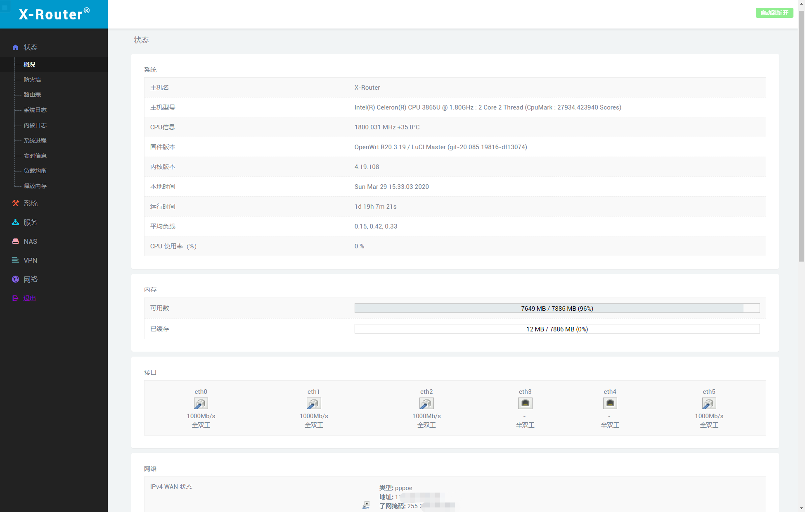
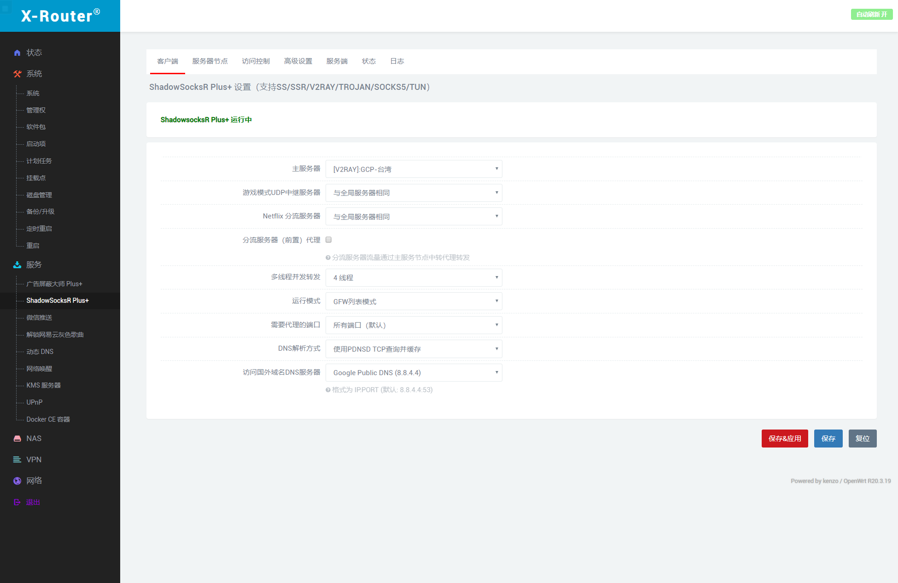
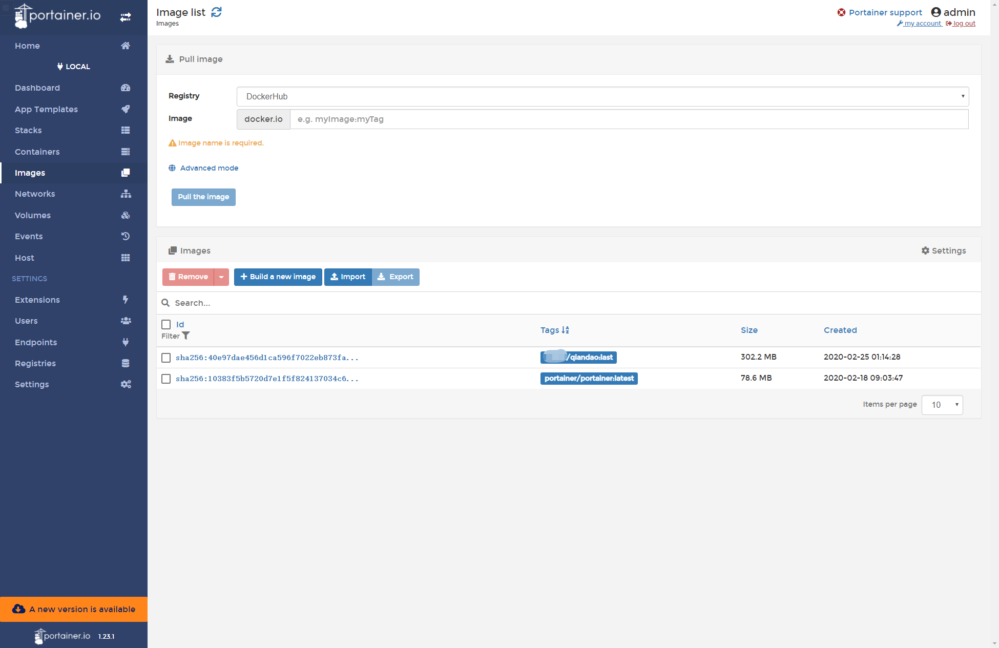
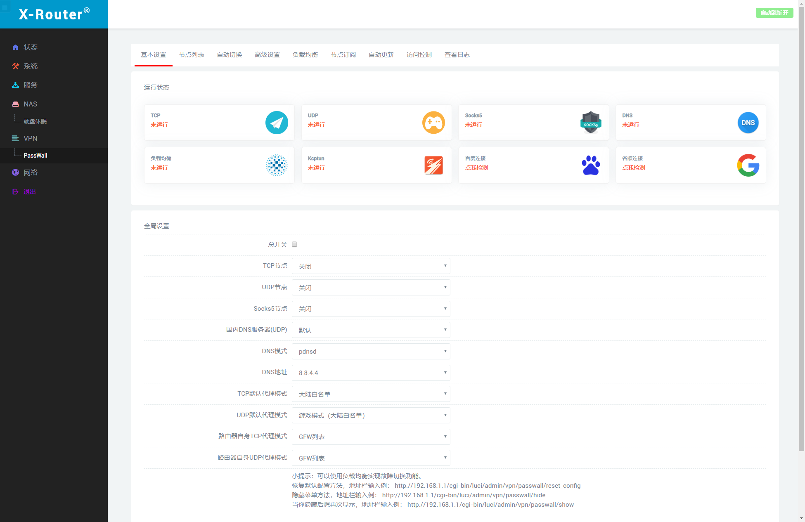

OpenWrt LEDE_x64
====

自编译的精简固件，仅支持因特尔系网卡；集成多拨、SSR+、DockerCE、微信通知、解锁网易云音乐灰色歌曲、磁盘分区等功能；修改默认分区大小，磁盘使用更自由；其他功能请看截图！
----

登录地址：[http://10.10.10.1](http://10.10.10.1)

登录帐号： `root`

登录密码： `123456`

20200515_17:25：更新较多，建议升级！

20200506_15:55：更新大量SSR+和passwall代码，修复一些小bug！

20200427_23:35：更新较多东西，自行体会，没有新增其他插件！

20200414_22:30：更新luci-app-serverchan到1.63版，修复passwall一些bug，修复SSR+一些bug！

20200408_16:00：内核升级到R20.4.8版！

20200407_12:58：更新luci-app-serverchan到1.49版，修复luci-app-diskman一些bug，修复passwall一些bug，修复SSR+一些bug！

20200402_15:02：修复一些bug，更新diskman到0.2.7版，停止发布uefi版！

20200330_14:50：修复内核版本显示bug，修复SSR+一些bug！

20200329_15:26：内核升级至4.19.215，调整SSR+编译的一些参数，升级“解锁网易云灰色歌曲”插件到0.2.0版。

20200327_20:18：修复CPU使用率显示bug，修复SSR+一些bug，增加订阅链接中“命中关键字的节点将被丢弃”功能，添加adbyby_plus+，添加PassWall扶墙插件。

20200326_22:29：修复SSR+一些bug，更新trojan到1.15.1版！

20200325_22:51：修复编译时一些错误，为SSR+内置国内IP文件！

20200325_16:55：更新v2ray到4.23.1，修复SSR+一些bug！

20200324_21:01：调整SSR+启动顺序！

20200324_18:50：更新SSR+代码，更新luci-app-serverchan到1.48版！

20200323_17:43：更新SSR+代码，继续精简了无线相关的内容！

20200322_17:20：更新SSR+代码！

20200319_15:39：修复SSR+的一些bug，增加"proxy in proxy"模式！

20200318_16:00：修复SSR+网飞模式等bug，更新luci-app-serverchan到1.47版本！

20200317_23:42：更新SSR+代码！

20200317_19:46：更新更新大量SSR+代码，添加了网飞分流模式；Docker管理由专门的web管理程序代替，更加方便直观！

20200316_23:23：更新SSR+等代码，更新luci-app-serverchan、luci-app-dockerman代码，删除adbyby_plus！

20200314_22:35：添加ADbyby_plus！

20200314：精简所有无线驱动及其他一些无用的插件，留下了一些实用的插件，支持一线多拨，调整了系统默认分区大小！

